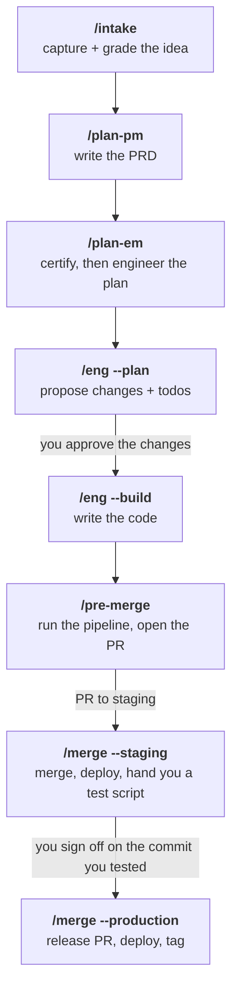

<div align="center">

<pre>
███╗   ███╗███████╗ ██████╗ 
████╗ ████║██╔════╝██╔════╝ 
██╔████╔██║███████╗██║  ███╗
██║╚██╔╝██║╚════██║██║   ██║
██║ ╚═╝ ██║███████║╚██████╔╝
╚═╝     ╚═╝╚══════╝ ╚═════╝ 
</pre>


</div>
<br/>

<p align="center"><strong>The harness for product-focused builders who want less reading code, and more reviewing what your code does.</strong></p>

<p align="center">
  <a href="LICENSE"></a>
  <a href="https://github.com/ndisisnd/msg/releases"></a>
  <a href="https://github.com/ndisisnd/msg/commits/main"></a>
  
  <a href="https://github.com/ndisisnd/msg/stargazers"></a>
</p>

<p align="center">
  <a href="#install">Install</a> ·
  <a href="#how-it-works">How it works</a> ·
  <a href="#the-skills">Skills</a> ·
  <a href="#how-to-update">Update</a> ·
  <a href="#faq">FAQ</a> ·
  <a href="llms.txt">llms.txt</a>
</p>

<p align="center"><sub>
  <b>AI agents / LLMs:</b> read <a href="llms.txt"><code>llms.txt</code></a>.
</sub></p>

<!-- mkpub:release v5.6.5 -->
> [!NOTE]
> **🚀 New in v5.6.5 · Long runs now survive interruptions, and cost less**
>
> If a session dies or you close your laptop mid-run, `plan-em` picks up where it left off instead of starting over — finished work stays finished, only the unfinished agents are re-dispatched. Compiled coding standards are also remembered between runs, and agent briefings are now ordered so the shared portion hits the prompt cache instead of being billed in full each time.
> Update with `curl -fsSL https://raw.githubusercontent.com/ndisisnd/msg/main/install.sh | bash -s -- --with-cook` · [Release notes](RELEASES.md)
<!-- /mkpub:release -->

---

## What it does

msg is the counterpart that relies on [`/cook`](https://github.com/ndisisnd/cook) — a heavily opinionated coding agent workflow and harness that depends on human approvals more than autonomy. You describe a feature, and msg walks it through capture, planning, engineering, building, a CI gate, a staging sign-off, and a production release. You approve at each gate; nothing ships on the agent's own judgment.

It installs as nine slash commands in Claude Code. There is no server and no account — every skill runs locally against your own repository.

- **Plan** — `/intake` captures and grades ideas into a backlog, `/plan-pm` writes the PRD, `/plan-review` certifies it, `/plan-em` writes the engineering sections.
- **Build** — `/eng --plan` proposes the file changes, `/eng --build` writes the code on a feature branch, `/eng --review` runs an adversarial pass over the diff.
- **Ship** — `/pre-merge` runs your test pipeline and opens the PR, `/merge` is the only skill that merges anything.
- **See it** — `/msg --gui` serves a local Notion-style PRD board on `127.0.0.1`.

**Run reports.** Every build, gate, and merge writes a report you can read: what was done, what you should now be able to do, and the exact steps to check it yourself. The board collects them under a Reports tab, grouped by feature.

**Closing message.** Every run ends by telling you where you stand — a 🟢 / 🟡 / 🔴 headline, one line of plain English, a short table of what happened, and the concrete next thing to run. Same shape whether it passed, needs your call, or hit a blocker.

**Safety floor.** No skill can quietly widen its own reach. `/eng` only commits to feature branches, `/pre-merge` opens a pull request but never merges it, and `/merge` is the only skill that merges anything — nothing reaches production except through a release you confirmed twice. The human gates don't disappear either: you sign off on staging, you're offered a rollback rather than given one, and production asks twice. See [ARCHITECTURE.md § Safety floor](ARCHITECTURE.md#safety-floor).

## Install

You need `git`, `curl`, Claude Code, and an authenticated [`gh` CLI](https://cli.github.com) (the gates use it to open and merge PRs).

### msg + cook (recommended)

```bash
curl -fsSL https://raw.githubusercontent.com/ndisisnd/msg/main/install.sh | bash -s -- --with-cook
```

### msg only

```bash
curl -fsSL https://raw.githubusercontent.com/ndisisnd/msg/main/install.sh | bash
```

**Verify it worked:**

```bash
cat ~/.claude/skills/msg/VERSION   # msg v5.6.3 — 7a0967e, installed 2026-08-03
ls ~/.claude/skills                # msg intake plan-pm plan-review plan-em eng pre-merge merge emulate shared
ls ~/.claude/scripts               # non-empty: script-preflight-*.sh, script-branch-protection.sh, ...
```

Inside Claude Code, `/msg --version` prints that same line from any repo. Check it after every
install or update: the skills live in `~/.claude`, not in your projects, so a reinstall that failed
halfway leaves every project looking exactly as it did before.

Then restart Claude Code fully and run `/msg`. If the menu doesn't render, the restart didn't pick up `~/.claude/skills` — quit and reopen rather than starting a new session.

New here? [QUICKSTART.md](./QUICKSTART.md) walks from install to your first shipped feature, with a verify check at every step. It also covers the step people miss: `/pre-merge` and `/merge` each need their own one-time `--init` before the pipeline runs anything.

**Current release: v5.0.1** — see [RELEASES.md](./RELEASES.md) for what's new, release by release.

## How it works

Each skill hands off to the next. Nothing runs automatically — you invoke each one, and the previous skill's closing message tells you which comes next.



`/plan-review` doesn't appear as a step because `/plan-em` runs it for you — so a build can never start on an uncertified plan. How often depends on the PRD's size: a medium one is certified once and then planned *and* built in a single `/plan-em` run; a large one is certified twice, once before it plans and once before it builds.

The gates are ordered on purpose. A skipped step surfaces later as a refusal with a named reason (`no_manifest`, `stale_signoff`, `release_in_flight`), not as a warning you can scroll past. [ARCHITECTURE.md](./ARCHITECTURE.md) covers the four layers underneath: the installer, the skill prompts, the ~58 scripts that handle everything decidable without a model, and the `devkit/` docs each project gets.

## The skills

Nine slash commands. Run `/msg` to browse them interactively, or invoke any one directly. `/msg --gui` opens a local PRD board on `127.0.0.1` — Kanban and table views, PRD editing, todo toggling, the backlog, project docs, and run reports.

### Plan

| Skill | What it's for |
|-------|---------------|
| `/msg --init` | Sets a project up, once. A short interview about what you're building and how you release it, then it writes the reference docs every other skill reads. Safe to re-run. |
| `/msg --update` | Adds anything msg gained since you set the project up. Shows you the change before making it, and never rewrites a line you already have. |
| `/msg --init-staging` | Adds a staging branch to a project that currently ships straight to production. The only skill that creates one. |
| `/msg --doctor` | Tells you when msg itself is misbehaving. Every skill logs its own glitches; this reads that log and reports what keeps recurring, so a broken tool is visible instead of quietly absorbed. |
| `/msg --version` | Tells you which release of msg is installed, in one line. Run it in any repo after installing or updating to confirm the new version actually landed — the skills live outside your projects, so a reinstall that silently failed otherwise looks identical to one that worked. |
| `/msg --aha` | Keeps the learnings log worth reading. Agents append lessons to `devkit/AHA.md` as they work; this sweeps the log, merges repeats, drops noise, and flags recurring lessons that should become a workflow, memory, or code change instead. |
| `/intake` | Where every idea and bug starts. It interviews you, fleshes out the thin ideas, suggests ones you hadn't thought of, splits anything too big to build in one go, and grades each for complexity and cost. |
| `/intake --update` | Changes an idea you already captured. A real change to the idea re-grades it; a wording fix doesn't. |
| `/intake --delete` | Drops an idea from the backlog. Warns you first about anything that depends on it, then asks you to confirm. |
| `/plan-pm` | Writes the PRD for you — user flows, edge cases, what "done" means — stopping only for the questions it genuinely can't answer itself. |
| `/plan-pm --update` | Brings an existing PRD up to the current template and style — one PRD or `--all`. Maintenance only: acceptance criteria, F-IDs, and everything engineering wrote stay untouched. |
| `/plan-review` | Checks the PRD is actually buildable before anyone builds it, and fixes what it can. You don't invoke this one; `/plan-em` runs it for you. |
| `/plan-em` | Turns the PRD into an engineering plan. It proposes a roster of specialists for the work — approving that roster is your only decision here — then puts them to work. |

### Build

| Skill | What it's for |
|-------|---------------|
| `/eng --plan` | Proposes the file changes and writes the todo list. Nothing gets written until you approve it. |
| `/eng --build` | Writes the code, on its own branch. Pauses for your sign-off before it commits, and again before touching a database, your data, or production config. |
| `/eng --review` | A fresh agent reads the whole change looking for problems. Runs inside `--build` by default; you can also point it at any branch yourself. |
| `/pre-merge` | Runs your project's checks — tests, lint, coverage, security, a smoke test — in a throwaway sandbox, then opens the pull request. One-time `/pre-merge --init` first, so it knows what your project actually has. |
| `/merge --staging` | Merges once CI is green, deploys to staging, and hands you a script to test it by. Your sign-off is pinned to the exact commit you tested. |
| `/merge --production` | The release. Double-confirms, opens the release PR, merges on green CI and human review, deploys, and tags the version. If the deploy goes wrong it offers you a rollback rather than taking one on its own. |
| `/emulate` | Runs the app on a simulator or emulator and opens the window on your desktop, from whatever branch you're on. Clears the leftover build processes from your last attempt first. `--ios` / `--adr` / `--expo` pick the lane; with no flag it reads which platform you ship from `devkit/PLATFORMS.md`. It never writes to your repo. |

Every flag and refusal each skill supports is in [ARCHITECTURE.md](./ARCHITECTURE.md).

## How to update

**Updating msg itself.** Re-run the installer. It shallow-clones `main` and copies over your existing install, sweeping the names retired in v5 (`plan-tune`, `post-merge`, and every pre-v5 script filename) so a stale copy can't shadow its replacement.

```bash
curl -fsSL https://raw.githubusercontent.com/ndisisnd/msg/main/install.sh | bash -s -- --with-cook
```

Restart Claude Code afterwards, the same as a first install.

**Updating a project msg already set up.** Three commands, each additive and preview-gated:

| Command | Reconciles |
|---------|-----------|
| `/msg --update` | `devkit/` files and template rows added to msg after your repo was bootstrapped |
| `/pre-merge --update` | the `components[]` manifest, as your test and lint tooling drifts |
| `/pre-merge --update-criticality` | the critical-test floor, as your suite grows |

None of them rewrite a line you already have.

## FAQ

**Why does `/pre-merge` refuse with `no_manifest`?**

Because `/pre-merge --init` hasn't run in this repo yet. Bootstrapping with `/msg --init` isn't enough — the CI gate needs a `components[]` manifest in `devkit/policy.json` describing which checks your project actually has. Without it the gate would run zero components and report a pass it hadn't earned, so it refuses instead.

**Why doesn't `/pre-merge` stop for my approval?**

Deliberately. The human look at a running build belongs to `/merge --staging`, where you get a real test script against a deployed build. Putting a gate in both places would mean testing the same content twice, so pre-merge holds none.

**Why does the gate say it's running "in a subagent"?**

Because it is, since v5.6.1. A `/pre-merge` or `/merge` run generates thousands of lines of machinery — tool logs, per-check reports, aggregation trails — and none of it is something you read. Running it in a subagent keeps that out of your conversation, so what comes back is just the verdict, the issue summary and what to do next. You also stop staring at a dark screen: the run reports progress every few minutes instead of going silent. Nothing about the output changes, and no approval moves — every question `/merge` asks you still gets asked by the main conversation, in the same order, with the same wording.

**Do I need cook?**

No. cook supplies the domain-specific coding standards msg loads before generating code. Without it every skill still works — it just skips the standards-loading step. It's recommended, not required, which is why the installer makes it a flag.

**Can I ship without a staging branch?**

Yes. `/msg --init` asks for your release flow, and `direct` is a supported answer. The staging sign-off is replaced by an inline human test at merge time — the gate moves, it doesn't disappear. If you start direct and later want staging, `/msg --init-staging` is the only path that creates the branch.

**Why is `features/` gitignored?**

PRDs, the `INTAKE.md` backlog, and `devkit/DOCTOR.md` are per-project working state, and the shared ledger table was a standing source of merge conflicts. They're local by design. What ships in this repo is the harness, not one project's plans.

**What happens when the harness itself misbehaves?**

It writes the failure down rather than stopping to reason about it. Every skill logs harness incidents to a local ledger, and `/msg --doctor` triages that ledger in one batch on demand — anything that keeps recurring graduates into a fix brief. Each fix has to leave behind a permanent automated check, and those checks run before every release, so the same fault can't come back quietly.

**What if my repo can't set branch protection?**

A private repo on a Free plan can't, and msg doesn't treat that as a failure. Branch protection is policy-conditional (`enforced` / `optional` / `skip`), so the stance is recorded as `optional` and the gate isn't blocked. Every human gate still stands — protection is the machine enforcement on top of them, not a replacement for them.

**Why did the run go quiet for eight minutes?**

Most likely it hit one long step — a full test suite, a deploy — with no natural
pause inside it to report from. Rather than go silent and unexplained, the run
announces the step and how long it's expected to take right before starting it,
so the quiet stretch is expected, not worrying. Outside of steps like that,
you'll see a short status line roughly every five minutes on any long-running
phase. Turn it off for one run with `--quiet`, or change how often it reports
with `--status <n>m`.

When a phase fans work out to parallel agents, the run also watches each one
for signs of life. An agent that has produced nothing gets mentioned at 5
minutes, flagged at 10, and assumed stuck at 15 — at which point the run tells
you plainly and asks whether to stop it or let it ride. Nothing is ever killed
automatically; that call is always yours.

**How do I know the review actually ran?**

Because it leaves a file behind. Every build that changes code is reviewed by a
different agent than the one that wrote it, and that reviewer now writes its result
to `reports/review-prd-<n>-<packet>.json` next to the run report. Before any
orchestrator reports a wave as done, it checks that every packet it built has one of
those files — and if one is missing it quietly spawns a reviewer over that packet's
changes and re-checks, rather than re-running the build. Only a second miss
interrupts you. `/pre-merge` reports the same coverage for the branch it grades.

The point is that a review that was skipped and a review that found nothing look
exactly the same from the outside, so "it ran" had to become something checkable
rather than something claimed. Review still gates nothing on its own — the green
`/pre-merge` run is the floor, as before.

## Documentation

- [QUICKSTART.md](./QUICKSTART.md) — install to first shipped feature, with a verify check per step
- [ARCHITECTURE.md](./ARCHITECTURE.md) — the four layers, the script inventory, the safety floor
- [RELEASES.md](./RELEASES.md) — what each release changed, in plain language
- [SECURITY.md](./SECURITY.md) — how to report a vulnerability
- [llms.txt](./llms.txt) — an index for agents landing in this repo

## License

[MIT](LICENSE)

## Acknowledgments

Credits to my dear JC who previously had her own harness with a bajillion agents. Great times.

<!-- mkpub: add anyone or anything else that actually helped here — prior art, a
     README you took the structure from, people who tested it. Delete this comment
     when you're done, or leave the section as-is if JC is the whole list. -->
